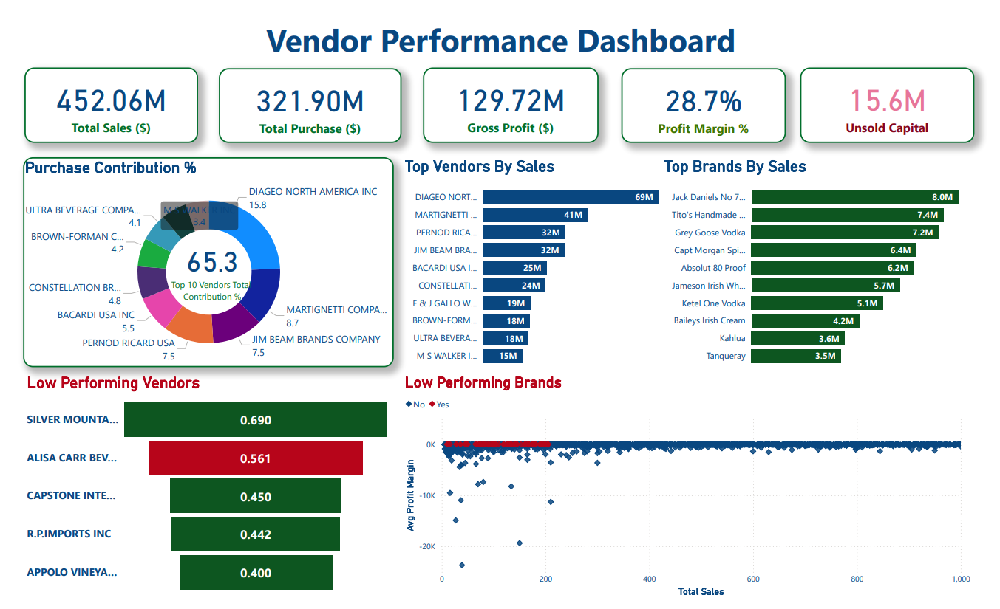

# Vendor Profitability and Supply Chain Performance Analysis

**Stack:** Python 3.11+ · pandas · SQLite · pytest · Power BI  
**Data scale:** 15.65 million transaction and inventory rows · 6 source tables · 129 vendors · 2024 fiscal year

[](https://app.powerbi.com/view?r=eyJrIjoiZDYwNTZmZTItYjFlMi00ZWIxLTlkYWUtMDRiZmE3MjZjOWEzIiwidCI6ImM2ZTU0OWIzLTVmNDUtNDAzMi1hYWU5LWQ0MjQ0ZGM1YjJjNCJ9)

---

## Business Findings and Recommendations

A beverage alcohol distributor managing 129 vendors and ~80 store locations had no consolidated analytical layer. Answering basic procurement and margin questions required manual work across six disconnected CSV files with no reliable vendor-level KPI view. This pipeline consolidates those into a single analytical output suite used by Supply Chain, Category Management, Inventory, and Procurement teams.

---

**Finding 1 — $210.3M in procurement is concentrated in 10 vendors (65.3% of total spend)**

DIAGEO NORTH AMERICA alone holds $51.0M — 15.8% of all purchasing. A disruption, pricing renegotiation, or contract change with any of these 10 vendors would affect the majority of purchasing volume without a market-wide event.

*Recommendation to Supply Chain Leadership:* initiate a vendor diversification review for the top 5 by spend, targeting a reduction in top-10 concentration from 65.3% to below 55% over two procurement cycles, by qualifying alternative-source vendors for the highest-volume SKUs.

---

**Finding 2 — Portfolio gross margin is 28.8%, but 5 high-volume SKUs are structurally unprofitable**

Overall reconstructed gross margin: 28.8% ($130.0M GP on $451.6M in sales, cost-basis matched rows only). Five SKUs with more than $100K in annual sales are running negative margins that are not explained by period-aggregation artifacts:

| SKU | Vendor | Annual Sales | Margin |
|---|---|---:|---:|
| Buehler Znfdl Napa | MARTIGNETTI COMPANIES | $119,617 | -15.7% |
| Ciroc Mango Vodka | DIAGEO | $164,084 | -6.0% |
| Smirnoff Watermelon Vodka | DIAGEO | $100,067 | -6.0% |
| Crown Royal Vanilla | DIAGEO | $176,578 | -5.2% |
| Crown Royal Nrth Harvest Rye | DIAGEO | $113,966 | -1.5% |

*Recommendation to Category Management:* audit purchase price vs. retail price for these five SKUs. Buehler Znfdl Napa at -15.7% on $119K in annual sales is the clearest case — the distributor is subsidising the sale at current pricing. Either renegotiate unit cost or reprice before the next contract cycle.

---

**Finding 3 — $15.6M in working capital is tied up in unsold inventory; top 10 vendors hold $10.12M of it**

The three largest single-SKU unsold positions are Diageo products with 90–92% sell-through — high-volume SKUs where even a small gap between procurement and sales creates material exposure:

| SKU | Unsold Value | Sell-Through |
|---|---:|---:|
| Smirnoff Traveler | $169,786 | 91.9% |
| Johnnie Walker Black Label | $144,338 | 89.8% |
| Johnnie Walker Red Label | $123,291 | 91.8% |

Five smaller vendors have unsold ratios above 80% of their entire procurement value — likely discontinued products or ordering errors that can be closed out without a full inventory audit.

*Recommendation to Inventory Management:* prioritise the three Diageo SKUs above for markdown or return negotiation before year-end close. Commission a targeted review of the five high-unsold-ratio small vendors — the combined exposure is recoverable working capital.

---

**Finding 4 — Q4 revenue runs 49.4% above Q1; December peaks at 75.2% above January**

| Month | Revenue | vs. January |
|---|---:|---:|
| January | $29.9M | baseline |
| April | $30.7M | +2.9% |
| July | $49.7M | +66.4% |
| November | $42.3M | +41.7% |
| December | $52.3M | +75.2% |

*Recommendation to Procurement Planning:* purchase orders for the top 20 SKUs by volume must be placed 10–14 days (observed lead time range) ahead of demand peaks. Buffer stock for Q3 and Q4 should be ordered by the 15th of the prior month. A $22.4M swing between the January trough and the December peak means under-stocking in Q4 translates directly to missed revenue.

---

**Finding 5 — Delivery performance baseline established; 5 vendors show elevated schedule risk**

Average lead time: 9.7 days (median 9.8, range 5–13). All 126 measurable vendors met the 14-day OTIF SLA proxy on this dataset — a clean baseline for future period-over-period comparison. Five vendors have the highest lead-time variance despite short average lead times:

| Vendor | Avg Lead Time | Variance | Total POs |
|---|---:|---:|---:|
| ALISA CARR BEVERAGES | 7.6 days | 6.44 | 19 |
| ALTAMAR BRANDS LLC | 7.9 days | 6.09 | 40 |
| STARK BREWING COMPANY | 9.2 days | 5.81 | 12 |
| STAR INDUSTRIES INC. | 8.3 days | 5.44 | 13 |
| Circa Wines | 8.0 days | 5.39 | 43 |

ALTAMAR BRANDS LLC is the most operationally relevant: 40 purchase orders annually with a variance of 6.09 means receiving windows are unpredictable even when the average looks acceptable.

*Recommendation to Operations:* apply a buffer-stock or minimum-order-cycle rule for these five vendors to absorb receiving-window uncertainty. The OTIF framework is instrumented and ready to produce tier differentiation if supply chain conditions tighten in future periods.

---

## Dashboard Preview



The dashboard covers vendor profitability, procurement concentration, working capital, and monthly sales trends across 129 vendors. Interactive views built in Power BI on the four pipeline output files. The `.pbix` file is in [`dashboard/vendor-performance.pbix`](dashboard/vendor-performance.pbix).

---

## Why I Built This

I found this dataset on Kaggle and picked it specifically because it had real problems in it — not a pre-cleaned toy dataset. The same vendor appeared under different legal entity names across three source files. Purchase orders had negative lead times (receiving date before the PO date). Product descriptions didn't match across tables.

The hardest part technically was the weighted average purchase price across 2.3 million rows read in 300,000-row chunks. A simple chunk-level mean gives the wrong answer when chunk sizes differ — I had to track running dollar and quantity totals separately and compute the true weighted average only at the end. The ExciseTax field in the sales data made the industry clear from the start: alcohol excise is collected from the distributor and passed through, so it inflates the headline sales price without affecting gross profit. I kept that in mind when setting up the margin calculations so the numbers would be defensible in an interview.

---

## Pipeline Architecture

```
purchases.csv       ──┐
sales.csv            ─┤
purchase_prices.csv  ─┼──► src/rebuild_pipeline.py ──► outputs/
vendor_invoice.csv   ─┤         │
begin_inventory.csv  ─┤    Canonical vendor map
end_inventory.csv    ─┘    Lead time + OTIF KPIs
                           Dollar reconciliation (penny-exact)
                           17-test validation suite
```

**Key decisions:**
- Memory-safe 300,000-row chunk reads for the 1.5GB sales file
- Modal-variant vendor name canonicalization across three source files
- Freight allocated to vendor-brand rows by purchase-dollar share — additive in Power BI
- 758 sales-only rows retained with `CostBasisAvailable = 0` rather than silently dropped

---

## KPIs Computed

| KPI | Formula | Source |
|---|---|---|
| Gross Profit | `TotalSalesDollars − TotalPurchaseDollars` | purchases, sales |
| Profit Margin % | `GrossProfit / TotalSalesDollars × 100` | computed |
| Sell-Through Rate | `TotalSalesQuantity / TotalPurchaseQuantity` | purchases, sales |
| Stock Turnover | `TotalPurchaseDollars / AllocatedAvgInventoryValue` | purchases, inventory |
| Unsold Inventory Value | `max(0, PurchaseQty − SalesQty) × PurchasePrice` | purchases, sales |
| Avg Lead Time (days) | `AVG(ReceivingDate − PODate)` per vendor | purchases |
| OTIF Rate % | `% of POs received within 14-day SLA proxy` | purchases |
| Vendor Reliability Tier | `TIER_1 (≥95%), TIER_2 (≥80%), TIER_3 (<80%)` | computed |
| Freight Cost | Vendor freight allocated by purchase-dollar share | vendor_invoice |

`SellThroughRate` and `StockTurnover` are not interchangeable — sell-through is quantity-based, stock turnover is value-based using allocated average inventory value by vendor-brand.

---

## How to Reproduce

> `outputs/` is empty in this repository — all CSV outputs are regenerated locally. `data/sample/` contains 5,000-row subsets for inspection without the full 1.9GB raw data package.

```bash
# Clone
git clone https://github.com/Ayushgithubcodebasics/vendor-intelligence-pipeline.git
cd vendor-intelligence-pipeline

# Install
python -m venv .venv
source .venv/bin/activate      # Windows: .venv\Scripts\activate
pip install pandas numpy sqlalchemy pytest

# Run on full data (place CSVs in data/raw/ first)
python -m src.rebuild_pipeline

# Run on sample data (no raw data needed)
python -m src.rebuild_pipeline --source sample

# Validate
pytest tests/ -v
```

**Full data:** 8–15 minutes. **Sample data:** under 30 seconds.  
Windows users: `run_rebuild_steps.ps1` · Mac/Linux users: `bash run_rebuild_steps.sh`

---

## Known Limitations

1. **Gross Profit is period-aggregated, not period-matched.** Sales in 2024 may draw from inventory purchased in prior periods — directionally reliable but not equivalent to a formal COGS-based accounting margin.

2. **OTIF uses a 14-day SLA proxy.** No explicit contracted delivery-date field exists in the raw data.

3. **Malformed `InventoryId` values** exist — most visible in Store 46. Not used as a join key anywhere in the pipeline.

4. **VendorName variants are normalised deliberately.** VendorNumber 1587 appears as both `VINEYARD BRANDS INC` and `VINEYARD BRANDS LLC` across source files; the pipeline maps these to a single canonical name.

5. **Sell-through outliers reach 274.5×.** 1,168 rows have `SellThroughRate > 2.0` — prior-period inventory contributing to 2024 sales. Filter or cap before using in averages.

6. **Profit-margin outliers reach −23,730%.** 698 rows have `|ProfitMargin| > 100%` — a consequence of period-aggregated cost basis, not a formula error.

---

## Project Structure

```
vendor-intelligence-pipeline/
├── README.md
├── requirements.txt
├── .gitignore
├── run_rebuild_steps.ps1        ← Windows runner
├── run_rebuild_steps.sh         ← Mac/Linux runner
├── data/
│   └── sample/                  ← 5,000-row quickstart samples
├── docs/
│   ├── findings.md              ← full findings with recommendation tables
│   ├── data_dictionary.md       ← field-level reference for all 6 source tables
│   └── dashboard_setup.md      ← Power BI connection and DAX measure notes
├── src/
│   ├── config.py
│   ├── ingestion.py
│   ├── transform.py
│   ├── reporting.py
│   ├── build_outputs.py
│   ├── rebuild_pipeline.py
│   └── ingest_sqlite.py
├── tests/
│   └── test_output_integrity.py ← 17 tests; 15 pass on sample, 17 on full data
├── dashboard/
│   └── vendor-performance.pbix
└── outputs/                     ← empty in repo; regenerated by pipeline
```

---

## What I Would Improve Next

- **Tighter OTIF threshold test:** run the framework at a 7-day SLA window to check whether tier differentiation becomes possible on this dataset, or whether lead times are too compressed regardless of threshold
- **Makefile:** `make run` and `make test` would replace the two separate shell scripts and work identically on Mac, Linux, and Windows Subsystem for Linux